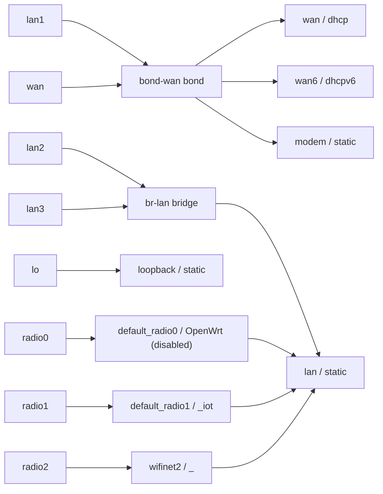
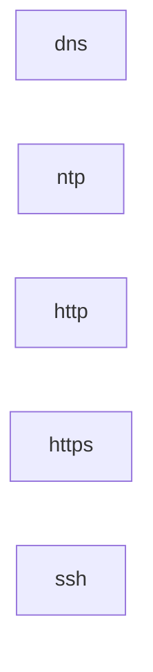

# Network core-router

Language 3.0. State: **Desired**. Domain: unspecified.

Model invariants and dependency ordering are certificate-checked by the Idris semantic core. Target realization is conditional on documented profiles. Applied state, physical connectivity, service health and observations are **Unknown**.

Routing/policy owner: gateway.

| Wireless station | Upstream AP |
| --- | --- |

## Device gateway

Explicit dual-stack interface and zone intent. Dynamic addresses, delegated prefixes, link state, and radio operation are **Unknown**.

| Link | Kind | Members | STP |
| --- | --- | --- | --- |
| br-lan | bridge | lan2, lan3 | default |
| bond-wan | bond | lan1, wan | n/a |

| Interface | Attachment | Protocol | IPv4 | IPv6 assignment | Gateway | DNS |
| --- | --- | --- | --- | --- | --- | --- |
| loopback | lo | static | 127.0.0.1/8 | none | none |  |
| lan | br-lan | static | 10.9.8.1/24 | /60 | none |  |
| wan | bond-wan | dhcp |  | none | none |  |
| wan6 | bond-wan | dhcpv6 |  | none | none |  |
| modem | bond-wan | static | 192.168.100.2/24 | none | none |  |

| DHCP interface | Pool | Active leases | IPv6 server | Router advertisements |
| --- | --- | --- | --- | --- |
| lan | 10.9.8.100 .. 10.9.8.199 | 100 | server | server |
| wan | none | 0 | default | default |

| Zone | Interfaces | Input | Output | Forward | IPv4 NAT |
| --- | --- | --- | --- | --- | --- |
| lan | lan | ACCEPT | ACCEPT | ACCEPT | no |
| wan | wan, wan6, modem | REJECT | ACCEPT | DROP | yes |

Firewall rules retain declaration order.

| Rule | From | To | Protocols | Action |
| --- | --- | --- | --- | --- |
| Allow-DHCP-Renew | wan | router | udp | ACCEPT |
| Allow-Ping | wan | router | icmp | ACCEPT |
| Allow-IGMP | wan | router | igmp | ACCEPT |
| Allow-DHCPv6 | wan | router | udp | ACCEPT |
| Allow-MLD | wan | router | icmp | ACCEPT |
| Allow-ICMPv6-Input | wan | router | icmp | ACCEPT |
| Allow-ICMPv6-Forward | wan | any zone | icmp | ACCEPT |
| Allow-IPSec-ESP | wan | lan | esp | ACCEPT |
| Allow-ISAKMP | wan | lan | udp | ACCEPT |

| Wi-Fi interface | Mode | SSID | Radio | Interface | Security | Enabled | WDS | Hidden | BSSID | Credential reference |
| --- | --- | --- | --- | --- | --- | --- | --- | --- | --- | --- |
| default_radio0 | ap | OpenWrt | radio0 | lan | none | no | default | default | unspecified | none |
| default_radio1 | ap | _iot | radio1 | lan | psk2 | yes | default | default | unspecified | secret://core-router/wifi/iot |
| wifinet2 | ap | _ | radio2 | lan | sae | yes | default | default | unspecified | secret://core-router/wifi/main |

Secret references identify externally held credentials. Wireless templates require binding before installation; the compiler never resolves credentials.

## VLANs and addressing

| VLAN | ID | IPv4 prefix | Gateway | DHCP |
| --- | --- | --- | --- | --- |

## Hosts

Static IP assignments must be configured on the hosts. No MAC-bound reservations are inferred.

| Host | VLAN | Address |
| --- | --- | --- |

## Devices and ports

| Device | Driver | Port | Membership | Connects to |
| --- | --- | --- | --- | --- |

## Services

| Service | Transport ports | Dependencies |
| --- | --- | --- |
| dns | udp/53, tcp/53 |  |
| ntp | udp/123 |  |
| http | tcp/80 |  |
| https | tcp/443 |  |
| ssh | tcp/22 |  |

## Static routes

| Route | Destination | Next hop | Device | VLAN | Metric |
| --- | --- | --- | --- | --- | --- |

## VLAN shorthand policy matrix

For VLAN shorthand: IPv4 connection initiation; established/related return traffic is accepted. New input and forwarding default to deny. Rules use declaration order. Gateway means local input; other destinations mean forwarding. DHCP requires gateway UDP/67 and TCP+UDP/53; contradictory denials are rejected. NAT is not inferred. Existing flows are not revoked.

| From | To | Action | Services |
| --- | --- | --- | --- |

## AAA and migration

AAA realization and migration source syntax are deferred beyond language 3.0. No AAA assurance or operational observation is inferred. This document represents a stable model with no migration debt.

## Physical topology

## Dependency graph

