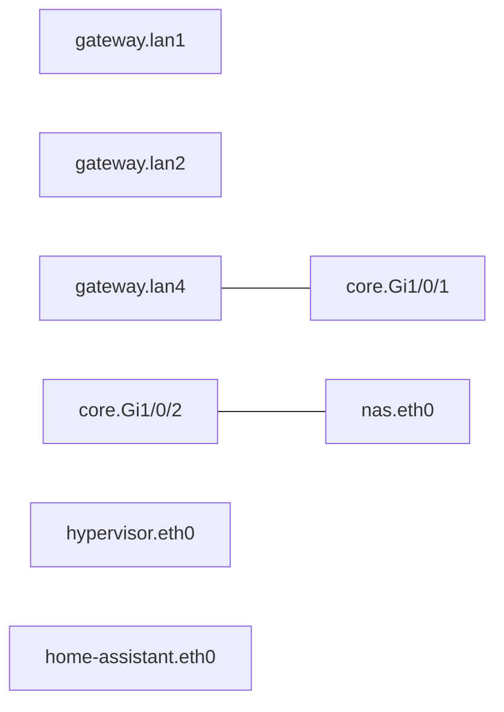
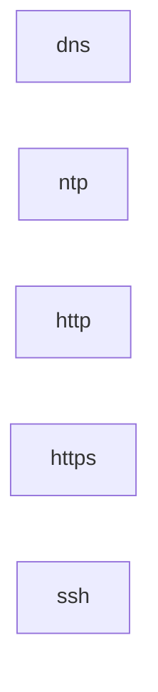

# Network home

Language 3.0. State: **Desired**. Domain: home.arpa.

Model invariants and dependency ordering are certificate-checked by the Idris semantic core. Target realization is conditional on documented profiles. Applied state, physical connectivity, service health and observations are **Unknown**.

Routing/policy owner: gateway.

| Wireless station | Upstream AP |
| --- | --- |

## VLANs and addressing

| VLAN | ID | IPv4 prefix | Gateway | DHCP |
| --- | --- | --- | --- | --- |
| trusted | 10 | 10.0.10.0/24 | 10.0.10.1 | 10.0.10.100 .. 10.0.10.199 |
| servers | 20 | 10.0.20.0/24 | 10.0.20.1 | disabled |
| iot | 30 | 10.0.30.0/24 | 10.0.30.1 | 10.0.30.100 .. 10.0.30.240 |

## Hosts

Static IP assignments must be configured on the hosts. No MAC-bound reservations are inferred.

| Host | VLAN | Address |
| --- | --- | --- |
| nas | servers | 10.0.20.10 |
| hypervisor | servers | 10.0.20.11 |
| home-assistant | servers | 10.0.20.20 |

## Devices and ports

| Device | Driver | Port | Membership | Connects to |
| --- | --- | --- | --- | --- |
| gateway | openwrt | lan1 | access trusted | unspecified |
| gateway | openwrt | lan2 | access servers | unspecified |
| gateway | openwrt | lan4 | trunk trusted, servers, iot | unspecified |
| core | cisco-ios | Gi1/0/1 | trunk trusted, servers, iot | gateway.lan4 |
| core | cisco-ios | Gi1/0/2 | access servers | nas.eth0 |

## Services

| Service | Transport ports | Dependencies |
| --- | --- | --- |
| dns | udp/53, tcp/53 |  |
| ntp | udp/123 |  |
| http | tcp/80 |  |
| https | tcp/443 |  |
| ssh | tcp/22 |  |

## Static routes

| Route | Destination | Next hop | Device | VLAN | Metric |
| --- | --- | --- | --- | --- | --- |

## VLAN shorthand policy matrix

For VLAN shorthand: IPv4 connection initiation; established/related return traffic is accepted. New input and forwarding default to deny. Rules use declaration order. Gateway means local input; other destinations mean forwarding. DHCP requires gateway UDP/67 and TCP+UDP/53; contradictory denials are rejected. NAT is not inferred. Existing flows are not revoked.

| From | To | Action | Services |
| --- | --- | --- | --- |
| trusted | internet | allow | all IPv4 protocols |
| trusted | servers | allow | all IPv4 protocols |
| iot | internet | allow | all IPv4 protocols |
| iot | gateway (gateway) | allow | dns, ntp |
| iot | trusted | deny | all IPv4 protocols |
| iot | servers | deny | all IPv4 protocols |

## AAA and migration

AAA realization and migration source syntax are deferred beyond language 3.0. No AAA assurance or operational observation is inferred. This document represents a stable model with no migration debt.

## Physical topology

## Dependency graph

